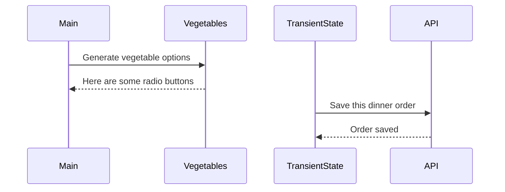

# Events and State Self-Assessment

> 🧨 Make sure you answer the vocabulary and understanding questions at the end of this document before notifying your coaches that you are done with the project

## Setup

1. Make sure you are in your `workspace` directory
1. `git clone {github repo SSH string}`
1. `cd` into the directory it creates
1. `code .` to open the project code
1. Use the `serve` command to start the web server
1. Open the URL provided in Chrome

## Requirements

### Initial Render

1. All 10 base dishes should be displayed as radio input options.
1. All 9 vegetables should be displayed as radio input options.
1. All 6 side dishes should be displayed as radio input options.
1. All previously purchases meals should be displayed below the meal options. Each purchase should display the primary key and the total cost of the purcahsed meal.

### State Management

1. When the user selects an item in any of the three columns, the choice should be stored as transient state.
1. When a user makes a choice for all three kinds of food, and then clicks the "Purchase Combo" button, a new sales object should be...
   1. Stored as permanent state in your local API.
   1. Represented as HTML below the **Monthly Sales** header in the following format **_exactly_**. Your output will not have zeroes, but the actual amount.
      ```html
      Receipt #1 = $00.00
      ```
   1. The user's choices should be cleared from transient state once the purchase is made.

## Design

Given the description and animation above...

1. Create an ERD for this application before you begin.
1. Make a list of what modules need to be created to make your application as modular as possible. Create a **Dependency Graph** for the project to be reviewed once you are complete with the assessment.
1. Create a **Sequence Diagram** that visualizes what your algorithm is for this project. We'll give you a minimal starting point.



## Vocabulary and Understanding

> 🧨 Before you click the "Assessment Complete" button on the Learning Platform, add your answers below for each question and make a commit. It is your option to request a face-to-face meeting with a coach for a vocabulary review.

1. Should transient state be represented in a database diagram? Why, or why not?
   > I would say no. Since transient state is temporary data that is locally stored, it generally has no reason to be included in a database diagram. Database diagrams should represent sustained, long-term data/tables and their relationships.
2. In the **FoodTruck** module, you are **await**ing the invocation of all of the component functions _(e.g. sales, veggie options, etc.)_. Why must you use the `await` keyword there? Explain what happens if you remove it.
   > Await is required due within those function invocations due to the procedures of asynchronous operations and how fetch requests are made.If we were to remove the await from those invocations, the "async" keyword in the function that is wrapping those invocations would always be awaiting or a pending object from the invocations, but nothing would ever be returned. The DOM would refuse to render the proper local API fetched data since it has nothing to work with and will result in a placeholder object name rendering instead.
3. When the user is making choices by selecting radio buttons, explain how that data is retained so that the **Purchase Combo** button works correctly.
   > Whenever a user clicks those options, an event listener in each food option's module captures a "change" event from the user pressing the radio button. The option selection Id is then used to call the corresponding function from TranState.js, which serves to assign that Id to an object and store it in the "tState" object. Finally, once "purchase combo" is clicked, that object data stored in "tState" is converted into JSON and stored in the database as a receipt.
4. You used the `map()` array method in the self assessment _(at least, you should have since it is a learning objective)_. Explain why that function is helpful as a replacement for a `for..of` loop.
   > There are a few reasons. It cuts down on lines of code required to achieve similar results. Instead of needing to make an array before the for of loop to store the new iterated data, it automatically implicitly does this. It makes the code overall more readable. You CAN achieve the same thing with a for of loop, but like all syntactic sugar, it is just functionally helpful and easier to read.
